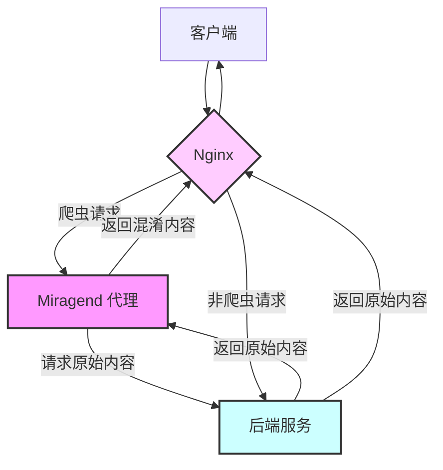

# Miragend

Miragend 是一个具有对抗能力的通用反向代理，它可以污染 AI 产品及其它类型的恶意爬虫。对于不尊重原创，未经授权的抓取，Miragend 会通过各种策略应对它们。

## 介绍和使用

为了应对 AI 产品类的恶意爬虫的数据抓取，动态网站通常可以轻易的返回虚假数据，但静态网站（例如 SSG 生成的博客）却无法这么做。而 Miragend 就是为这个场景设计的通用方案，它并不要求后端具备什么能力。

将需要数据保护的请求路由给 Miragend 代理访问即可，它工作在前置代理（如 Nginx）和后端之间：

请参考这篇[中文教程](https://blog.hentioe.dev/posts/miragend-introduction-tutorial.html)了解详细的使用方法。

## 效果演示

- [混淆后的页面](https://blog.hentioe.dev/posts/miragend-introduction-tutorial.html?miragend=obfus)
- [混淆后的 JSON](https://blog.hentioe.dev/miragend-demo.json?miragend=obfus)

## 未来计划

下阶段计划可参照 [0.2.0 TODOs issue](https://github.com/Hentioe/miragend/issues/2) 页面。

我正在考虑将 Miragend 实现为一个能独立运作的反向代理工具，包括对非 HTML/JSON 资源的代理支持（以流的形式）。以及针对图像的特殊代理，例如将图像压缩为相同尺寸的马赛克版本响应给爬虫。因为原创图片也被 AI 广泛用于训练，图片也需要对抗。

如果你有什么想法，请到 [issues](https://github.com/Hentioe/miragend/issues) 页面提出。
